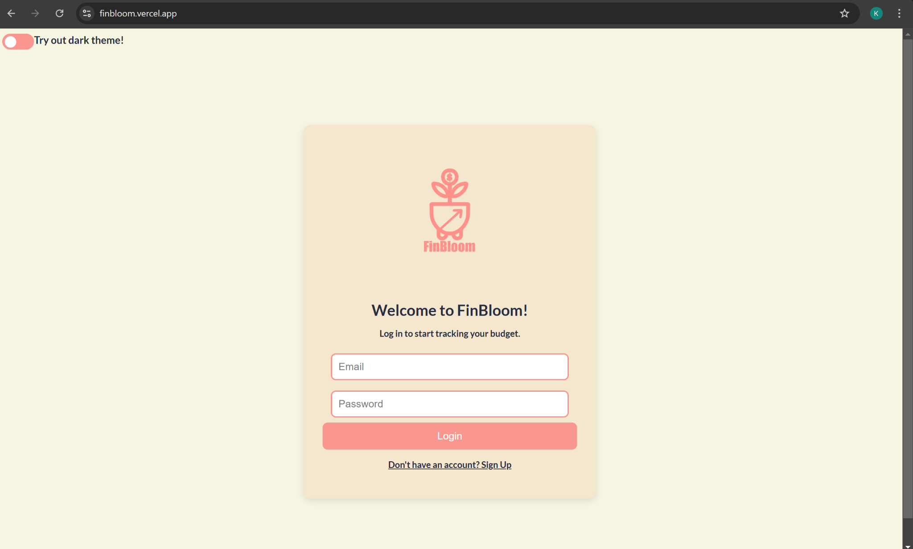
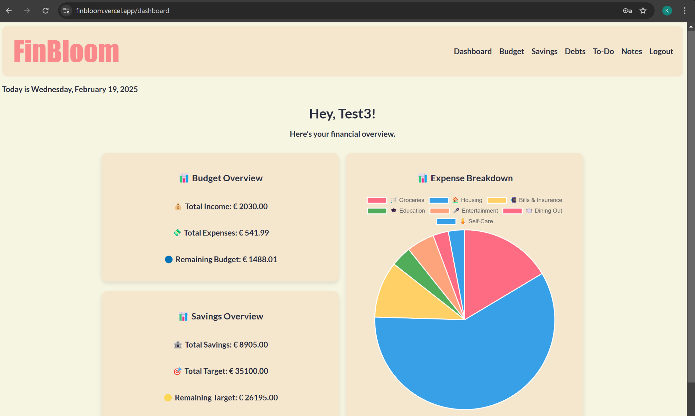

# 🌿 FinBloom - Budget Tracking App

## 📌 Overview
**FinBloom** is a modern and user-friendly **budget-tracking application** designed to help users **manage income, expenses, savings, and debts** effectively. With **interactive visualizations** and **structured financial summaries**, FinBloom empowers users to take control of their finances.

#### Hosted version at [finbloom.vercel.app](https://finbloom.vercel.app/)
### 🧑‍💻 Test Account
To try the app without signing up, use:
Email: test3@gmail.com  
Password: Test3!

---

## 🎯 Features
✅ **Income & Expense Tracking** – Log, edit, and delete income sources and expenses.  
✅ **Fixed & Non-Fixed Expenses** – Separate fixed expenses (e.g., rent) from variable ones (e.g., dining out).  
✅ **Savings Management** – Track savings progress and set financial goals.  
✅ **Debt Tracking** – Monitor debts with repayment progress bars.  
✅ **Pie Charts & Graphs** – Visualize expense breakdowns for better insights.  
✅ **Firebase Authentication** – Secure login/logout system.  
✅ **Dark & Light Mode** – Seamless theme switching.  

---

## 🛠️ Tech Stack
- **Frontend**: React.js (Hooks, Context API)
- **Database**: Firebase Firestore (for user data storage)
- **Authentication**: Firebase Authentication
- **Styling**: CSS Modules (Component-based styling)
- **Deployment**: Vercel (Frontend hosting)

---

## 🚀 Installation & Setup
### 1️⃣ Clone the Repository
```
git clone https://github.com/kristimarkus1/FinBloom_project.git
cd FinBloom_project
```

### 2️⃣ Install Dependencies
```
npm install
```

### 3️⃣ Configure Firebase
1. Install firebase
```
npm install firebase
```

2. Create a Firebase project at Firebase Console.
3. Enable Firestore & Authentication (Email/Password).
4. Copy your Firebase credentials and create a .env file:
```
REACT_APP_FIREBASE_API_KEY=your_api_key
REACT_APP_FIREBASE_AUTH_DOMAIN=your_auth_domain
REACT_APP_FIREBASE_PROJECT_ID=your_project_id
REACT_APP_FIREBASE_STORAGE_BUCKET=your_storage_bucket
REACT_APP_FIREBASE_MESSAGING_SENDER_ID=your_sender_id
REACT_APP_FIREBASE_APP_ID=your_app_id
```

### 4️⃣ Start the App
```
npm start
```

Runs the development server at http://localhost:3000.

---

## 📸 Screenshots




---

## 📝 License
- This project is open-source and available under the MIT License. Feel free to use, modify, and contribute! 🌱

---

### Made by Kristi Markus.
